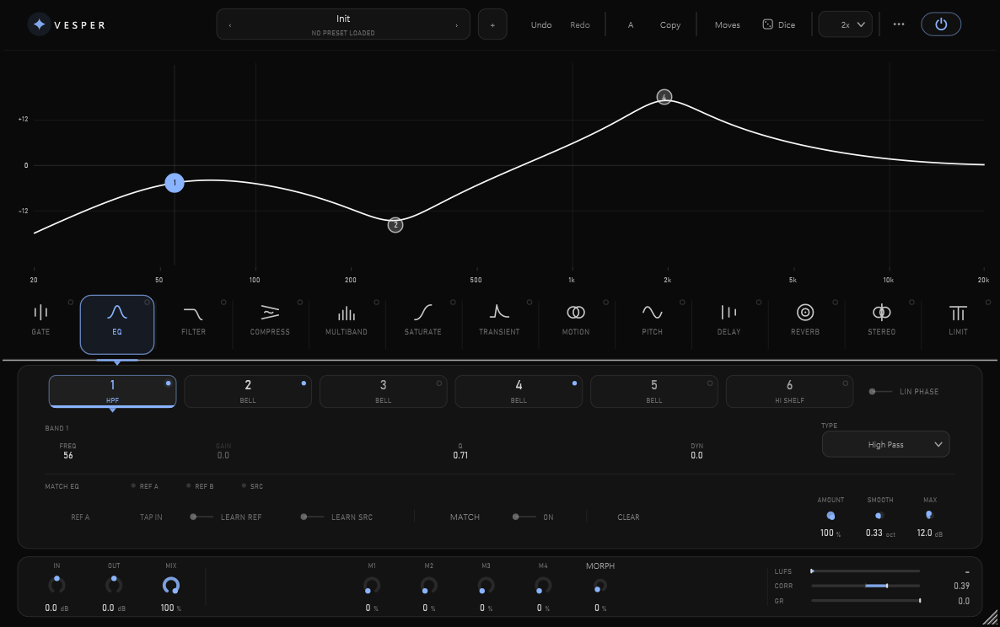
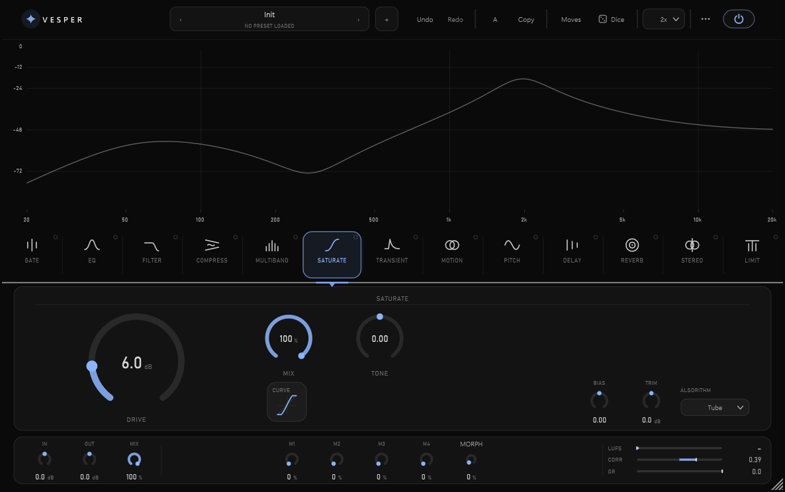
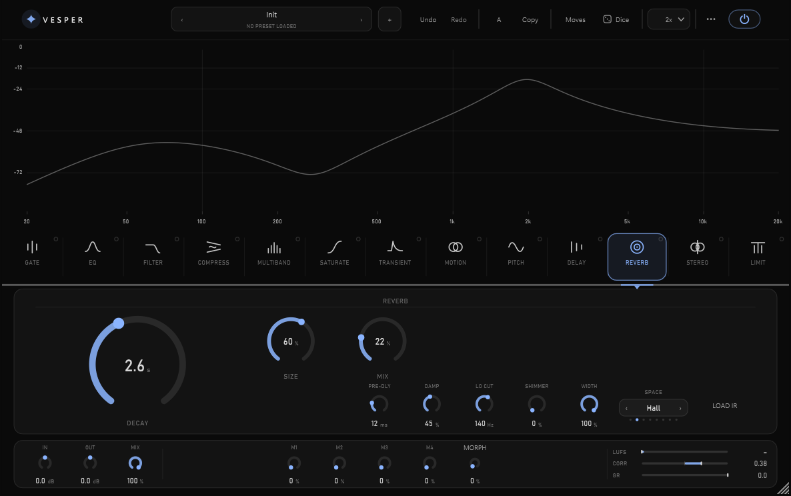
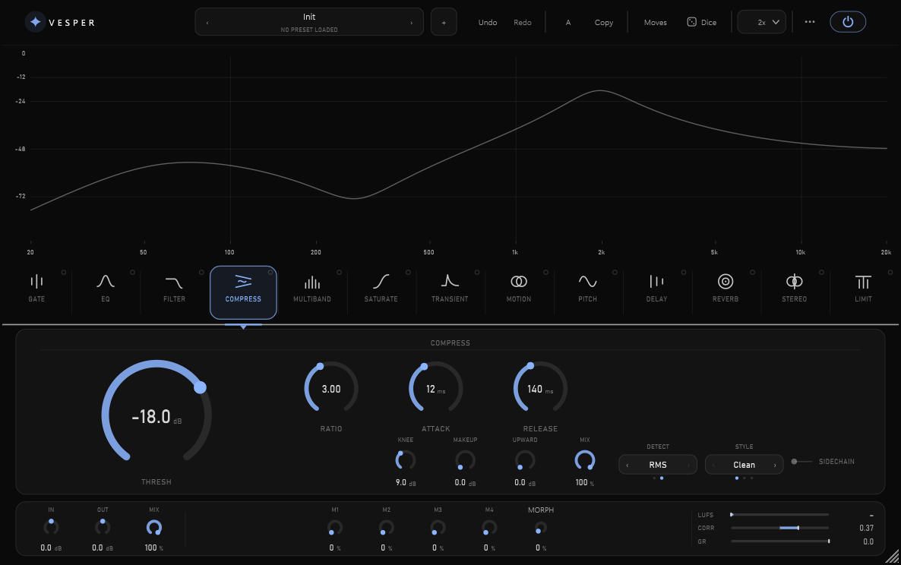
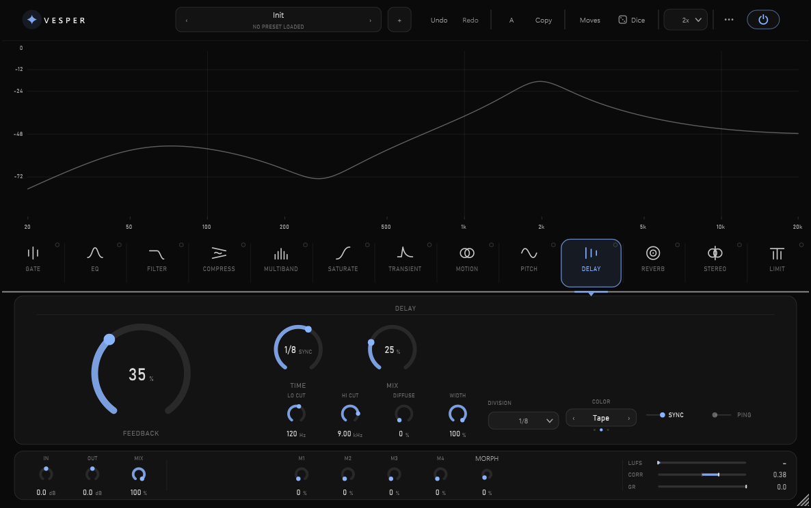
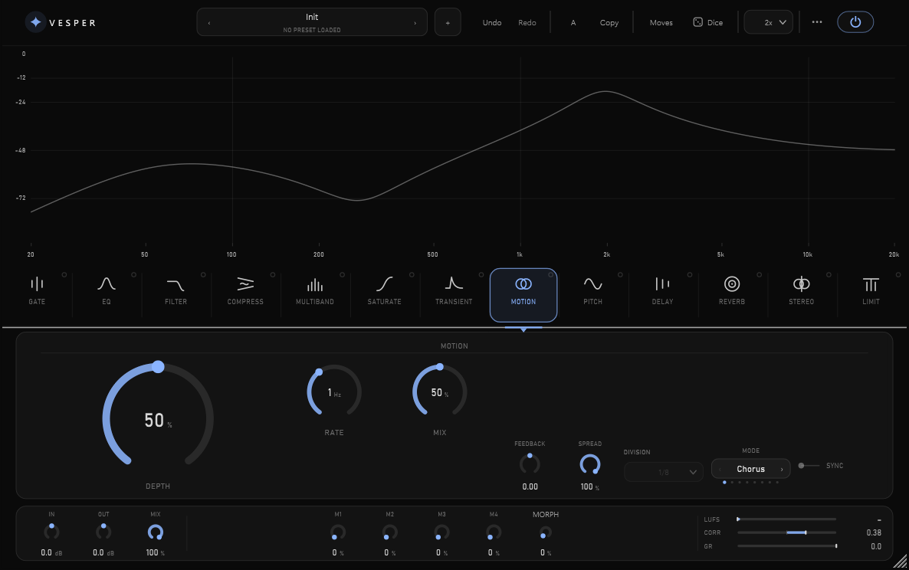

<p align="center">
  
</p>

# Vesper: One Plugin Instead of a Utility Chain

> **Thirteen reorderable modules in one window** — seventeen saturation
> algorithms, shimmer reverb, linear-phase match EQ — behind one calm interface
> where colour only ever marks what's live. 49 integration checks drive the real
> processor and 142 unit checks cover the DSP behind it; both suites are in this
> repo and both run green in seconds.

   



<sup>The EQ: six bands, on-curve node editing, a calibrated axis, and the match-EQ
strip — all reachable without leaving the panel.</sup>

---

Most sessions end up with the same five utility plugins stacked in the same order,
each with its own idea of what a knob should look like. **Vesper is one plugin that
replaces that chain** — and lets you put the modules in *any* order you want.

- **Reorderable** — drag the module cards; the swap is lock-free and click-free,
  packed into a single atomic `uint64` so the audio thread never takes a lock
- **17 saturation algorithms** — tube, tape, transformer, console, triode, pentode,
  germanium, silicon, foldback, wavefold, bitcrush, downsample and more, each with
  1–16× polyphase oversampling
- **Linear-phase match EQ** — learn a reference spectrum, learn the source, and
  design a corrective FIR by frequency sampling; matches tone, not level
- **Convolution + FDN reverb** — Spring, Cathedral, Reverse and user IRs, with
  shimmer that can't run away: feedforward into the convolution input, and trading
  feedback energy in the FDN tank so its loop gain stays below 1
- **Dynamic EQ** — six bands, each optionally adaptive against a moving reference
- **Metering that states its source** — momentary LUFS to the BS.1770 K-weighting
  constants (+4 dB shelf at 1681.97 Hz, Q 0.7071; RLB highpass at 38.13 Hz),
  plus correlation and gain reduction

**Think of it as:** the utility chain you always build, except it opens in one window,
loads one preset, and stays out of the way.

---

## Tested harder than the feature list suggests

Audio bugs hide. Both suites live in this repo and both run in seconds once you
have built (see [Quick Start](#quick-start)):

```bash
./build/VesperTests_artefacts/Release/VesperTests.exe              # 142 checks
./build/VesperIntegration_artefacts/Release/VesperIntegration.exe  # 49 checks
```

- **142 unit checks**, 0 failures, across the DSP classes
- **49 integration checks**, 0 failures, driving the *real* processor — because a
  design function proven correct says nothing about whether the parameter reaches it
- **An automation harness** that drives every parameter of all 13 modules min-vs-max
  and asserts the output actually changed
- **A negative control** in that harness — a deliberately unsmoothed gain that *must*
  trip it. It caught two bugs in the harness itself (warm-up blocks polluting the
  in-block set; a 3-tap second difference straddling the block edge at both `i` and
  `i+1`) that would otherwise have made the whole suite pass vacuously
- **CI on every push to `main`, every version tag and every pull request**
  ([`.github/workflows/ci.yml`](.github/workflows/ci.yml)): both suites build and run
  on Windows, macOS and Linux; **pluginval at strictness 8** runs on Windows and
  macOS. Plus a manual sweep at pluginval strictness 10 — the maximum — across
  5 sample rates × 7 block sizes, alongside a Debug build of both suites with JUCE
  assertions and the leak detector active ([`docs/ROADMAP.md`](docs/ROADMAP.md),
  Phase 10). CI enforces strictness 8; strictness 10 is the manual sweep

---

## Quick Start

```bash
git clone https://github.com/Xer0z-gh/Vesper.git
cd Vesper
cmake -B build -G Ninja -DCMAKE_BUILD_TYPE=Release
cmake --build build
```

JUCE 7.0.12 is fetched automatically. The VST3 lands in
`build/Vesper_artefacts/Release/VST3/`. Copy it to
`C:\Program Files\Common Files\VST3\` and rescan in your DAW. A standalone build
is produced alongside it.

Full toolchain notes — including the portable no-admin MinGW setup — are in
[docs/BUILDING.md](docs/BUILDING.md).

---

## The Interesting Parts

Things in here that were harder than they look:

| Problem | What it took |
|---|---|
| **Reordering modules without clicks** | Chain order is a packed `uint64`, 4 bits per slot, swapped atomically — no locks, no allocation, no zipper |
| **A filter that doesn't blow your head off** | Measured broadband gain at every model and resonance — worst case **+11.8 dB**; a calibrated per-model compensation brings every model/resonance pair under the **+6 dB** the unit suite enforces, without touching timbre |
| **Match EQ that matches tone, not level** | Long-term average spectra → Hermitian target → inverse FFT → windowed linear-phase FIR, with the broadband offset removed |
| **Proving every knob works** | The min-vs-max automation harness above, and the negative control that keeps it honest |
| **Shimmer that can't run away** | Restructured as feedforward into the convolution input, so the runaway feedback path is structurally impossible |

---

## Design Language

The interface is governed by a written design system, not by taste-of-the-day.
Five primitives — **Rule, Point, Arc, Numeral, Space** — a ×1.6 proportion ladder,
a strict four-colour discipline, and motion that carries information rather than
decoration.

It's documented in [docs/design/](docs/design/) (philosophy → geometry → colour →
typography → motion → interaction → components → tokens → layout). UI code is
written against those documents; ad-hoc visual decisions are treated as defects.

Every module is a card with the same anatomy: a named header, the primary control
given the space it deserves, and secondaries falling away by weight rather than by
being hidden. Short choice lists get ‹ › steppers with page dots; only long lists
get a pick-list.



<sup><b>Saturate</b> — the card plots the real transfer curve of the selected
algorithm, so the shape you hear is the shape you see.</sup>



<sup><b>Reverb</b> — decay leads, the rest recede. SPACE is a stepper, not a dropdown,
because eight options don't need a menu.</sup>

---

## What's In The Box

- **13 modules** — Gate, EQ, Filter, Compressor, Multiband, Saturator, Transient,
  Motion, Pitch, Delay, Reverb, Stereo, Limiter
- **42 factory presets**, grouped by category, embedded into the binary at build time
- **Macro engine** — assign any parameter to M1–M4 with pinned min/max travel
- **Sidechain bus** for the compressor and gate
- **True-peak limiting** with a 16-tap inter-sample detector
- **Workflow** — A/B + copy, full undo/redo, searchable preset browser with tags and
  favourites, 75–200 % UI scale, high-contrast mode. **Every slider is named,
  announces a value and is keyboard-focusable** — asserted by walking the live editor
  in [`tests/IntegrationMain.cpp`](tests/IntegrationMain.cpp), not claimed (D-046).
  MORPH is the one slider built outside the shared knob class, so it sets its name,
  its value text and its keyboard focus by hand
  ([`src/VesperEditor.cpp`](src/VesperEditor.cpp))
- **System-wide use on Windows** via Equalizer APO — see
  [docs/EQUALIZER-APO.md](docs/EQUALIZER-APO.md)

<details>
<summary><b>More modules</b> — Compress, Delay, Motion</summary>



<sup><b>Compress</b> — threshold, ratio, attack and release, with the gain-reduction
meter reading in the performance strip along the bottom.</sup>



<sup><b>Delay</b> — time reads its division while synced to host tempo; colour and
filtering shape every repeat, not just the first.</sup>



<sup><b>Motion</b> — eight modulation modes on one clock, rate locked to the host
grid when SYNC is on.</sup>

</details>

---

## Documentation

| Document | What's in it |
|---|---|
| [ARCHITECTURE.md](docs/ARCHITECTURE.md) | How the processor, parameters and UI fit together |
| [DSP-DESIGN.md](docs/DSP-DESIGN.md) | The signal processing, module by module |
| [BUILDING.md](docs/BUILDING.md) | Toolchain, portable setup, build gotchas |
| [MANUAL.md](docs/MANUAL.md) | Every control, in plain language |
| [ROADMAP.md](docs/ROADMAP.md) | Where this is going |
| [design/](docs/design/) | The visual design system |

---

## Built With

C++20 · [JUCE 7.0.12](https://juce.com) · CMake + Ninja · a custom assertion-based
test harness · [pluginval](https://github.com/Tracktion/pluginval)

## License

Copyright © 2026 Sable Audio. Vesper is free software, released under the
**GNU General Public License v3.0** — see [LICENSE](LICENSE).

You may use, study, modify and redistribute it under those terms. JUCE is
dual-licensed (GPLv3 or commercial); this project takes the GPLv3 path, which is
what permits the JUCE splash screen to be disabled here.

As the copyright holder, Sable Audio may also make Vesper available under separate
commercial terms.

VST is a trademark of Steinberg Media Technologies GmbH.

---

Built by Tanner ([@Xer0z-gh](https://github.com/Xer0z-gh)) — available for
contract work on audio, desktop and internal tooling. Reach me at
tanner8206@gmail.com.
